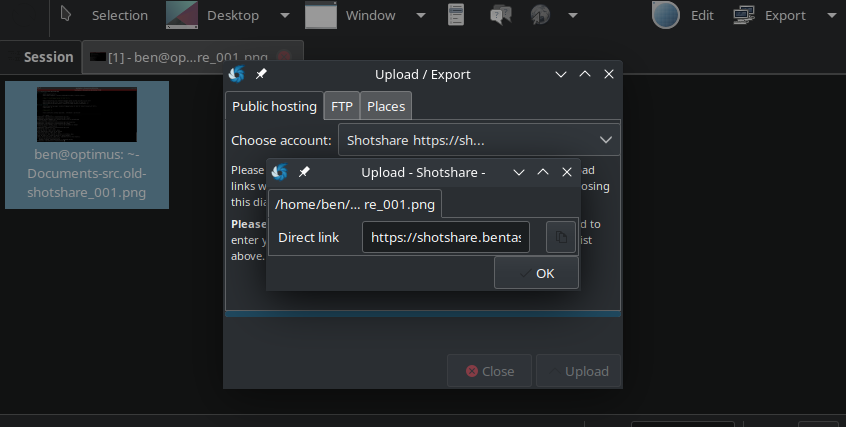

# ShotShare Upload Plugin for Shutter

Uploads a file to [ShotShare](https://github.com/mdshack/shotshare) and provides you the Shotshare URL

This is an upload plugin for [Shutter](http://shutter-project.org/).

----

### ShotShare Config

* Log into your ShotShare instance and then click your avatar in the top right
* Choose `Profile`
* Scroll down to `API Keys`
* Click `Create API Key`
* Provide a memorable name and then click `Create API Key`
* Make a note of the generated token

----

### Shutter Setup

Copy the plugin to Shutter's upload plugin directory

```sh
sudo cp Shotshare.pm /usr/share/shutter/resources/system/upload_plugins/upload/
```

(re)Start Shutter and then `Edit` -> `Preferences` -> `Upload`

Find the `Shotshare` entry and then double click in the Username column.

Enter the URL of your ShotShare install (e.g. `https://shotshare.example.com`) (no trailing slash)

Double click in the `Password` column and then paste your Shotshare API Token

Click `Close`

Take a screenshot

Right click on it -> `Export` -> Select `Shotshare` -> `Upload`

You should get a dialog providing you with a URL:



Copy the URL, close the dialog and then paste the URL into your browser, you should be taken to your uploaded screenshot.

----

### Automating Upload

Unfortunately, Shutter [does not currently support this](https://bugs.launchpad.net/shutter/+bug/468352/).
